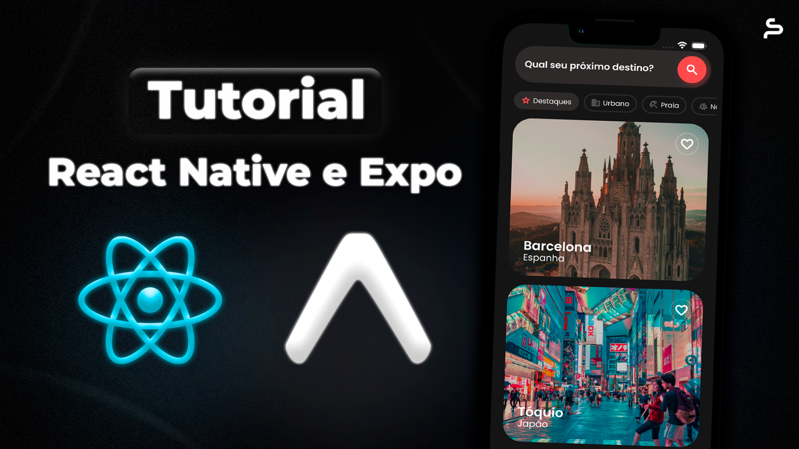

# Expo para Iniciantes — Seu Primeiro App do Zero!

[Tutorial de React Native para iniciantes com Expo](https://youtu.be/FULK2o5TRiM) — aprenda, passo a passo, a criar seu primeiro aplicativo!

Neste [vídeo](https://youtu.be/FULK2o5TRiM) você vai aprender:

- Como configurar o ambiente de desenvolvimento
- Como usar componentes como `View`, `Text` e `Image`
- Como trabalhar com listas (`FlatList`) e navegação com o Expo Router

Ideal para quem quer começar a desenvolver apps mobile com JavaScript e React Native.

#### Conheça nosso Curso Completo de React Native CLI e Expo:

### 👨🏻‍💻 Quem é seu Professor?

**Lucas Garcez** é um especialista de destaque em React Native, com **mais de 6 anos de experiência** prática no desenvolvimento de aplicativos de alto desempenho para empresas no **Brasil e no exterior**. Reconhecido por sua capacidade única de simplificar o complexo e por sua **abordagem prática e didática**, Lucas é a referência no ensino de **React Native avançado**. Atualmente, ele reside na Austrália, onde atua como **engenheiro de software sênior**, aplicando diariamente as técnicas e conceitos que ensina. Com isso, ele oferece aos seus alunos um **conhecimento diretamente alinhado às demandas do mercado global**, tornando-se um dos poucos professores qualificados a ensinar **React Native no nível que as empresas realmente exigem**.

- [LinkedIn](https://www.linkedin.com/in/lucas-garcez-a5636b157/?locale=pt_BR)
- [GitHub](https://github.com/LucasGarcez)
- [YouTube](https://www.youtube.com/@Coffstack)
